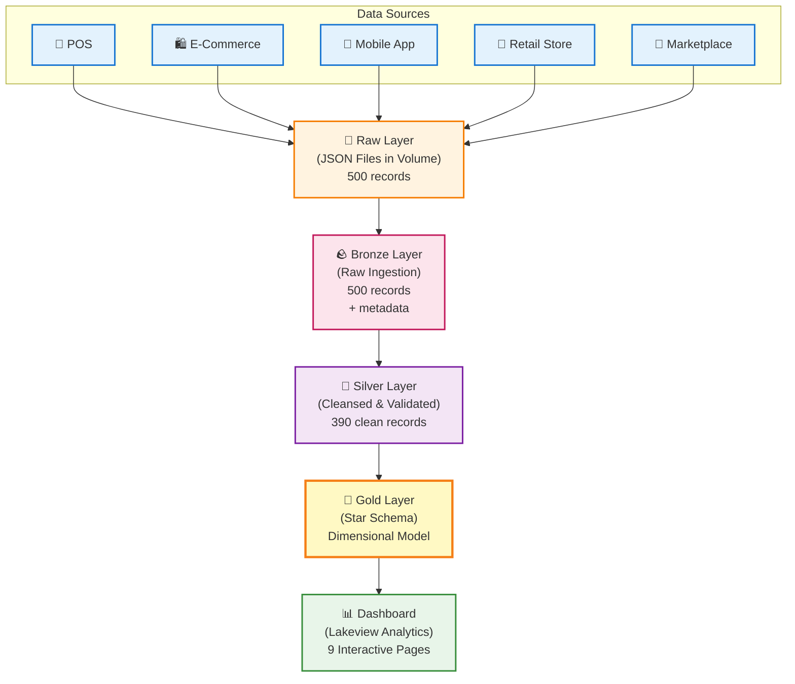
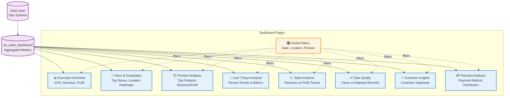
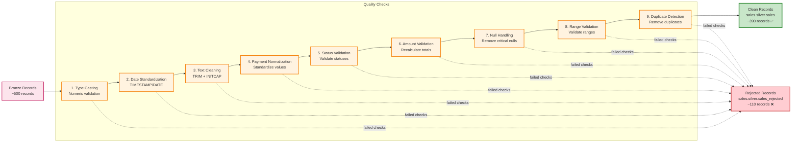
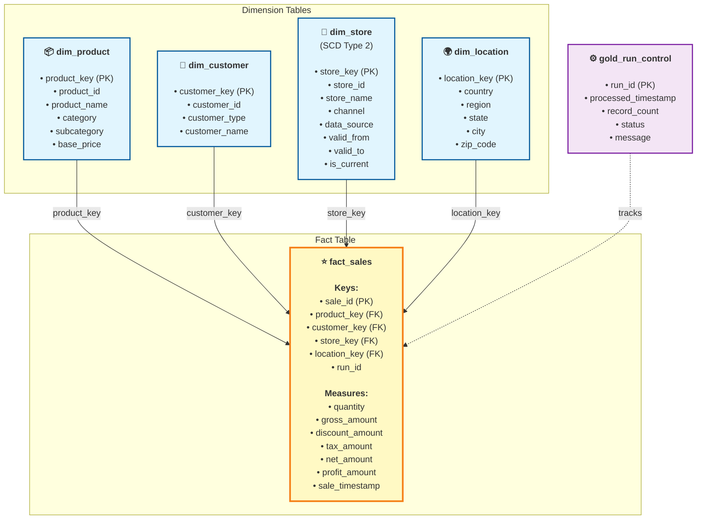
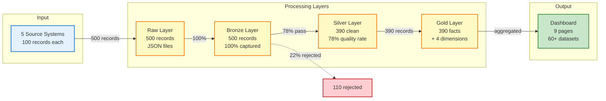
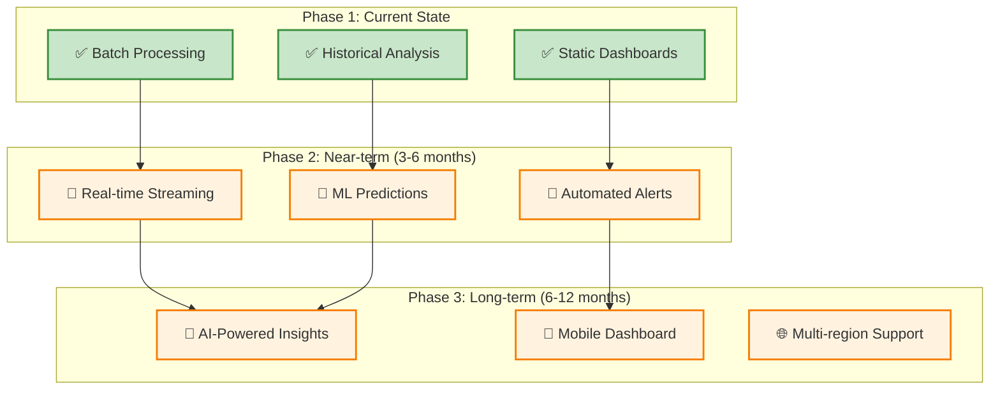

# Sales Data Pipeline - Medallion Architecture

<div align="center">

**A production-grade end-to-end data pipeline implementing the Medallion Architecture**

[](https://github.com/rohitkumar8873/sales)
[](https://www.databricks.com/)
[](#architecture)
[](#license)

</div>

---

## ✨ Quick Highlights

```
📦 5 Source Systems  →  📄 500 Records/Run  →  🎯 78% Data Quality  →  📊 9-Page Dashboard
├─ POS System              ├─ Bronze: 100% Captured    ├─ 390 Clean Records      ├─ Executive Overview
├─ E-Commerce              ├─ Silver: Validated        ├─ 110 Rejected           ├─ Product Analysis  
├─ Mobile App              ├─ Gold: Star Schema        └─ SCD Type 2            ├─ Store Geography
├─ Retail Store            └─ Delta Lake ACID                                  ├─ Customer Insights
└─ Marketplace                                                              └─ 7 more pages...
```

### 🚀 Key Features

| Feature | Description |
|---------|-------------|
| 🥇 **Medallion Architecture** | Bronze → Silver → Gold data refinement |
| ✅ **Data Quality** | 9-stage validation with rejected records tracking |
| 📊 **Star Schema** | Dimensional model with 1 fact + 4 dimension tables |
| 🔄 **Idempotent** | Safe re-runs, run-based retention (7 runs) |
| 📧 **Orchestrated** | Databricks Job with email notifications |
| 🔐 **Version Controlled** | Git integration with GitHub |
| 📈 **Analytics Ready** | 9-page Lakeview dashboard with 60+ datasets |
| ⚡ **Delta Lake** | ACID transactions, time travel, schema evolution |

---

## 📚 Table of Contents

* [📊 Project Overview](#-project-overview)
  * [Architecture](#architecture)
* [🌐 Dashboard Overview](#-dashboard-overview--architecture)
* [🏗️ Pipeline Components](#-pipeline-components)
  * [Raw Layer](#1-raw-layer---data-generation)
  * [Bronze Layer](#2-bronze-layer---raw-ingestion)
  * [Silver Layer](#3-silver-layer---cleansed-data)
  * [Gold Layer](#4-gold-layer---dimensional-model)
  * [Dashboard](#5-dashboard)
* [💼 Workflow Orchestration](#-workflow-orchestration-sales_jobyml)
* [📁 Complete Pipeline Flow](#-complete-pipeline-flow-diagram)
* [📁 Directory Structure](#-directory-structure)
* [⚙️ Configuration](#-configuration)
* [🎯 Key Features](#-key-features)
* [🔧 Running the Pipeline](#-running-the-pipeline)
* [📈 Data Volume & Metrics](#-data-volume--pipeline-metrics)
* [🔍 Sample Queries](#-sample-queries)
* [🐛 Troubleshooting](#-troubleshooting)
* [🔮 Future Scope](#-future-scope--enhancements)

> **Note:** This README contains interactive Mermaid diagrams. If diagrams don't render:
> - View on GitHub (supports Mermaid natively)
> - Use a Mermaid-compatible markdown viewer
> - Open diagram source files (.mmd) in a [Mermaid Live Editor](https://mermaid.live/)

---

## 📊 Project Overview

This project demonstrates a production-grade data pipeline that ingests sales data from multiple source systems, cleanses and transforms it through medallion layers, and creates a dimensional model for analytics and visualization.

### Architecture



## 🏗️ Pipeline Components

---

## 🌐 Dashboard Overview & Architecture

### Dashboard Structure

The project includes an interactive **9-page Lakeview dashboard** (`sales`), fed by the gold-layer dimensional model through the `vw_sales_dashboard` view.



### Key Dashboard Features

| Page | Purpose | Key Metrics |
|------|---------|-------------|
| **Executive Overview** | High-level business metrics | Total Revenue, Total Profit, Transaction Count, Avg Order Value |
| **Global Filters** | Cross-page filtering | Date Range Picker, Country, State, City, Category, Payment Method |
| **Store & Geography** | Store performance analysis | Store Revenue, Store Profit, Geographic Distribution |
| **Product Analysis** | Product-level insights | Top 10 Products by Revenue/Profit, Category Performance |
| **Last 7 Days** | Recent trends monitoring | 7-Day Revenue, Transaction Velocity, Trending Products |
| **Sales Analysis** | Time-series analysis | Revenue vs Profit Trends, Seasonal Patterns |
| **Data Quality** | Pipeline health monitoring | Total Records, Clean Records, Rejected Records, Quality Rate % |
| **Customer Insights** | Customer behavior | Customer Type Distribution, High-Value Customers |
| **Payment Analysis** | Payment trends | Payment Method Distribution, Channel Analysis |

### 📸 Dashboard Screenshots

**Dashboard Link:** [Open Sales Dashboard](#dashboard-01f1a2db5aa415479caa6196ed33e0af)

<!-- Dashboard screenshots will be added here -->

---

---


### 1. Raw Layer - Data Generation
**Notebook**: `Sales Generate data/raw layer`

#### 📥 Data Generation Process

```
┌─────────────────────────────────────────────────────────────────────────────┐
│ STEP 1: SYNTHETIC DATA GENERATION (RAW LAYER)                              │
├─────────────────────────────────────────────────────────────────────────────┤
│                                                                             │
│  🏪 5 Independent Source Systems (100 records each)                         │
│                                                                             │
│  ┌─────────────────────────────────────────────────────────────┐            │
│  │ POS (Point of Sale)                                         │            │
│  │ • Channel: Store                                            │            │
│  │ • Payment Methods: Cash, UPI, Credit/Debit Card             │            │
│  │ • Store Prefix: POS-XXX                                     │            │
│  └─────────────────────────────────────────────────────────────┘            │
│                                                                             │
│  ┌─────────────────────────────────────────────────────────────┐            │
│  │ E_COMMERCE (Web Platform)                                   │            │
│  │ • Channel: Online                                           │            │
│  │ • Payment Methods: UPI, Cards, Net Banking, Wallet          │            │
│  │ • Store Prefix: WEB-XXX                                     │            │
│  └─────────────────────────────────────────────────────────────┘            │
│                                                                             │
│  ┌─────────────────────────────────────────────────────────────┐            │
│  │ MOBILE_APP (Mobile Application)                             │            │
│  │ • Channel: Mobile App                                       │            │
│  │ • Payment Methods: UPI, Credit Card, Wallet                 │            │
│  │ • Store Prefix: APP-XXX                                     │            │
│  └─────────────────────────────────────────────────────────────┘            │
│                                                                             │
│  ┌─────────────────────────────────────────────────────────────┐            │
│  │ RETAIL_STORE (Physical Stores)                              │            │
│  │ • Channel: Store                                            │            │
│  │ • Payment Methods: Cash, UPI, Credit/Debit Card             │            │
│  │ • Store Prefix: RETAIL-XXX                                  │            │
│  └─────────────────────────────────────────────────────────────┘            │
│                                                                             │
│  ┌─────────────────────────────────────────────────────────────┐            │
│  │ MARKETPLACE (Third-party Platform)                          │            │
│  │ • Channel: Marketplace                                      │            │
│  │ • Payment Methods: UPI, Cards, COD, Wallet                  │            │
│  │ • Store Prefix: MKT-XXX                                     │            │
│  └─────────────────────────────────────────────────────────────┘            │
│                                                                             │
│  🌍 Global Location Coverage (30+ cities)                                   │
│  • India: Delhi, Mumbai, Pune, Bengaluru, Chennai, Hyderabad, Kolkata      │
│  • USA: New York, Los Angeles, Chicago, San Francisco                      │
│  • UK: London, Manchester, Birmingham                                       │
│  • Australia: Sydney, Melbourne                                            │
│  • Asia-Pacific: Tokyo, Singapore, Dubai                                   │
│                                                                             │
│  📦 Product Catalog (70+ products across 5 categories)                      │
│  ├─ Electronics: Laptops, Phones, Tablets, Headphones, etc.                │
│  ├─ Fashion: Clothing, Shoes, Accessories                                  │
│  ├─ Home: Appliances, Furniture, Décor                                     │
│  ├─ Sports: Equipment, Apparel, Accessories                                │
│  └─ Beauty: Cosmetics, Skincare, Fragrances                                │
│                                                                             │
│  🐛 Intentional Data Quality Issues (for testing)                          │
│  • Negative quantities (index 0)                                           │
│  • Null prices (index 1)                                                   │
│  • Misspelled cities/countries (index 2-3)                                 │
│  • Whitespace in payment methods (index 4)                                 │
│  • Invalid category names (index 5)                                        │
│  • Out-of-range discounts/tax (index 6-7)                                  │
│  • Extreme amounts (index 8)                                               │
│  • Null store IDs (index 9)                                                │
│  • Invalid product IDs (index 10)                                          │
│  • Unknown order statuses (index 11)                                       │
│  • Invalid currencies (index 12)                                           │
│  • Negative shipping costs (index 13)                                      │
│  • Duplicate sale IDs (index 14)                                           │
│                                                                             │
│  📥 Data Storage                                                           │
│  └─ Volume: /Volumes/{catalog}/{raw_schema}/sales_generated_data/          │
│     ├─ pos/sales.json (100 records)                                        │
│     ├─ e_commerce/sales.json (100 records)                                 │
│     ├─ mobile_app/sales.json (100 records)                                 │
│     ├─ retail_store/sales.json (100 records)                               │
│     └─ marketplace/sales.json (100 records)                                │
│                                                                             │
│  📊 Audit Tracking                                                         │
│  └─ Table: sales.raw_layer.sales_generation_audit                          │
│     • run_id (UUID)                                                        │
│     • run_timestamp                                                        │
│     • source_name                                                          │
│     • record_count                                                         │
│     • file_path                                                            │
│                                                                             │
└─────────────────────────────────────────────────────────────────────────────┘
```

#### Key Features:
- **500 total records** (100 per source system)
- **30+ global cities** across 5 countries/regions
- **70+ products** across 5 major categories
- **15 intentional quality issues** (22% rejection rate by design)
- **Run-based tracking** with UUID for idempotency

### 2. Bronze Layer - Raw Ingestion
**Notebook**: `Bronze/bronze`

#### 🪨 Bronze Ingestion Process

```
┌─────────────────────────────────────────────────────────────────────────────┐
│ STEP 2: RAW DATA INGESTION (BRONZE LAYER)                                  │
├─────────────────────────────────────────────────────────────────────────────┤
│                                                                             │
│  📂 Source File Reading                                                     │
│  Input Paths:                                                                │
│    /Volumes/{catalog}/{raw_schema}/sales_generated_data/pos/sales.json      │
│    /Volumes/{catalog}/{raw_schema}/sales_generated_data/e_commerce/sales.json│
│    /Volumes/{catalog}/{raw_schema}/sales_generated_data/mobile_app/sales.json│
│    /Volumes/{catalog}/{raw_schema}/sales_generated_data/retail_store/sales.json│
│    /Volumes/{catalog}/{raw_schema}/sales_generated_data/marketplace/sales.json│
│                                                                             │
│  🔄 Read Strategy:                                                          │
│    spark.read.json(source_paths)  # Schema-on-read                          │
│                                                                             │
│  🏷️ Bronze Metadata Enrichment                                            │
│                                                                             │
│  ┌─────────────────────────────────────────────────────────────┐            │
│  │ _source_file                                               │            │
│  │ • Data Type: STRING                                       │            │
│  │ • Source: F.col("_metadata.file_path")                 │            │
│  │ • Purpose: Track originating JSON file                  │            │
│  │ • Example: "...sales_generated_data/pos/sales.json"     │            │
│  └─────────────────────────────────────────────────────────────┘            │
│                                                                             │
│  ┌─────────────────────────────────────────────────────────────┐            │
│  │ _bronze_ingestion_timestamp                                │            │
│  │ • Data Type: TIMESTAMP                                   │            │
│  │ • Source: F.current_timestamp()                         │            │
│  │ • Purpose: Capture exact ingestion time                 │            │
│  │ • Example: "2026-08-30 14:23:45.123"                   │            │
│  └─────────────────────────────────────────────────────────────┘            │
│                                                                             │
│  ┌─────────────────────────────────────────────────────────────┐            │
│  │ _bronze_ingestion_date                                     │            │
│  │ • Data Type: DATE                                        │            │
│  │ • Source: F.current_date()                              │            │
│  │ • Purpose: Partition key for time-travel queries        │            │
│  │ • Example: "2026-08-30"                                 │            │
│  └─────────────────────────────────────────────────────────────┘            │
│                                                                             │
│  ┌─────────────────────────────────────────────────────────────┐            │
│  │ _record_hash                                               │            │
│  │ • Data Type: STRING                                       │            │
│  │ • Algorithm: SHA-256                                     │            │
│  │ • Source: F.sha2(F.to_json(struct(*columns)), 256)      │            │
│  │ • Purpose: Record-level lineage & deduplication         │            │
│  │ • Example: "a3f5b2...89c4d1" (64-char hex)              │            │
│  └─────────────────────────────────────────────────────────────┘            │
│                                                                             │
│  💾 Data Persistence                                                      │
│  └─ Table: {catalog}.bronze.sales                                          │
│     • Format: Delta Lake                                                   │
│     • Mode: OVERWRITE with overwriteSchema=true                            │
│     • Schema: Auto-detected from JSON + 4 metadata columns                 │
│     • Columns: ~40 business columns + 4 metadata columns                   │
│     • Records: 500 (100% capture rate)                                     │
│                                                                             │
│  ✅ Data Quality                                                            │
│  • No validation or cleansing                                              │
│  • All records accepted (even invalid ones)                                │
│  • Schema-on-read preserves original structure                             │
│  • Quality issues intentionally preserved for Silver layer testing         │
│                                                                             │
│  📊 Validation Check                                                       │
│  └─ Source distribution by data_source:                                   │
│     ├─ POS: 100 records                                                    │
│     ├─ E_COMMERCE: 100 records                                             │
│     ├─ MOBILE_APP: 100 records                                             │
│     ├─ RETAIL_STORE: 100 records                                           │
│     └─ MARKETPLACE: 100 records                                            │
│                                                                             │
└─────────────────────────────────────────────────────────────────────────────┘
```

#### Bronze Layer Principles:
- **100% Data Capture**: Accept all records regardless of quality
- **Minimal Transformation**: Preserve raw structure for auditability
- **Metadata Enrichment**: Add lineage tracking without modifying business data
- **Delta Lake Foundation**: ACID transactions and time travel capabilities
- **Schema Evolution**: Automatic schema detection handles source changes

### 3. Silver Layer - Cleansed Data
**Notebook**: `Silver/silver`

#### 🥈 Silver Transformation Process

```
┌─────────────────────────────────────────────────────────────────────────────┐
│ STEP 3: DATA CLEANSING & VALIDATION (SILVER LAYER)                         │
├─────────────────────────────────────────────────────────────────────────────┤
│                                                                             │
│  📊 Input: {catalog}.bronze.sales (500 records)                            │
│                                                                             │

- **Data Quality Rules**:



  **Quality Check Details:**
  - **Type Casting**: Numeric validation for quantity, prices, tax, discount
  - **Date Standardization**: TIMESTAMP and DATE type conversions
  - **Text Cleaning**: TRIM + INITCAP for consistency
  - **Payment Method Standardization**: Normalize payment types
  - **Order Status Standardization**: Validate and normalize status values
  - **Amount Validation**: Recalculate expected amounts and flag discrepancies
  - **Null Handling**: Remove records with critical null values
  - **Range Validation**: Validate numeric ranges (prices, quantities, percentages)
  - **Duplicate Detection**: Identify and handle duplicate transactions

### 4. Gold Layer - Dimensional Model
**Notebook**: `gold/gold`

- **Purpose**: Create a star schema optimized for analytics
- **Input**: `{catalog}.silver.sales`
- **Output**: Star schema with fact and dimension tables

#### Star Schema Design



**Fact Table Details:**
- **fact_sales**: Grain = one row per sale transaction
  - Foreign keys to all dimensions
  - Measures: quantity, amounts, discounts, taxes, profit
  - Run-based partitioning for incremental loads
  - Retention: Latest 7 runs

**Dimension Table Details:**
- **dim_product**: Product catalog with categories and subcategories
- **dim_customer**: Customer attributes and type
- **dim_store**: Store information with SCD Type 2 (historical tracking)
- **dim_location**: Geographic hierarchy (country, region, state, city, zip)

**Control Table:**
- **gold_run_control**: Tracks processing runs for idempotency

**Features**:
- Idempotency checks (prevents duplicate processing)
- Surrogate key generation
- SCD Type 2 for store dimension
- Data retention management (7 runs)
- Deduplication within runs

### 5. Dashboard
**Dashboard**: `sales`

- Visual analytics and reporting on gold layer data
- Automated refresh after gold layer processing

---

## 💼 Workflow Orchestration: sales_job.yml

**File**: `sales_job.yml` _(Declarative Automation Bundle)_

This file orchestrates the entire pipeline using Databricks Jobs. Each task (notebook/dashboard) is a node, sequenced with strict dependencies for production-grade reliability.

### Job Task Flow

```mermaid
graph LR
    START(["Job Start"]):::start
    
    T1["Task 1:<br/>sales_generation<br/>📝 Notebook<br/>Generate synthetic data"]:::task
    T2["Task 2:<br/>bronze<br/>📝 Notebook<br/>Raw ingestion"]:::task
    T3["Task 3:<br/>silver<br/>📝 Notebook<br/>Data cleansing"]:::task
    T4["Task 4:<br/>gold<br/>📝 Notebook<br/>Dimensional model"]:::task
    T5["Task 5:<br/>dashboard<br/>📊 Dashboard<br/>Refresh analytics"]:::task
    
    END(["Job Complete<br/>📧 Email Notification"]):::end
    
    START --> T1
    T1 -->|depends_on| T2
    T2 -->|depends_on| T3
    T3 -->|depends_on| T4
    T4 -->|depends_on| T5
    T5 --> END
    
    classDef start fill:#c8e6c9,stroke:#2e7d32,stroke-width:3px
    classDef task fill:#bbdefb,stroke:#1565c0,stroke-width:2px
    classDef end fill:#c8e6c9,stroke:#2e7d32,stroke-width:3px
```

### Task Configuration Details

| Task | Type | Path | Dependencies | Purpose |
|------|------|------|--------------|----------|
| **sales_generation** | Notebook | `Sales Generate data/raw layer` | None | Generate 500 synthetic sales records from 5 sources |
| **bronze** | Notebook | `Bronze/bronze` | sales_generation | Ingest JSON files → Bronze Delta table |
| **silver** | Notebook | `Silver/silver` | bronze | Cleanse & validate → Silver tables (clean + rejected) |
| **gold** | Notebook | `gold/gold` | silver | Build star schema → Gold dimensional model |
| **dashboard** | Dashboard | Dashboard ID: `01f1a2db...` | gold | Refresh Lakeview dashboard with latest data |

### Job Features

**Configuration:**
```yaml
resources:
  jobs:
    sales:
      name: sales
      email_notifications:
        on_success: [rohitkumarpiro86031@gmail.com]
        on_failure: [rohitkumarpiro86031@gmail.com]
      git_source:
        git_url: https://github.com/rohitkumar8873/sales
        git_provider: gitHub
        git_branch: main
      queue:
        enabled: true
      performance_target: PERFORMANCE_OPTIMIZED
```

**Key Features:**
- ✅ **Sequential Dependencies**: Each task waits for upstream completion
- 📧 **Email Notifications**: Success/failure alerts
- 🔄 **Git Integration**: Version-controlled pipeline from GitHub
- 📦 **Queue Enabled**: Manages concurrent job runs
- ⚡ **Performance Optimized**: Optimized for speed and cost

### 📸 Job Execution Screenshot

<!-- Job execution graph screenshot will be added here -->

## 📁 Complete Pipeline Flow Diagram

This diagram shows the end-to-end data flow from source systems through all medallion layers to the final dashboard.

```mermaid
graph TB
    subgraph "Source Systems"
        POS["<b>POS</b><br/>Point of Sale<br/>(100 records)"]
        ECOM["<b>E-Commerce</b><br/>Web Platform<br/>(100 records)"]
        MOBILE["<b>Mobile App</b><br/>Mobile Channel<br/>(100 records)"]
        RETAIL["<b>Retail Store</b><br/>Physical Store<br/>(100 records)"]
        MARKET["<b>Marketplace</b><br/>3rd Party<br/>(100 records)"]
    end

    subgraph "Raw Layer (Volume)"
        GEN["<b>Data Generation</b><br/>Sales Generate data/raw layer<br/>• Synthetic data creation<br/>• Product catalogs<br/>• Location data<br/>• Intentional quality issues"]
        RAWVOL[("<b>JSON Files</b><br/>Volume: sales_generated_data<br/>• pos/sales.json<br/>• e_commerce/sales.json<br/>• mobile_app/sales.json<br/>• retail_store/sales.json<br/>• marketplace/sales.json")]
        AUDIT[("<b>Audit Table</b><br/>sales_generation_audit")]
    end

    subgraph "Bronze Layer (Raw Ingestion)"
        BRONZE_NB["<b>Bronze Notebook</b><br/>Bronze/bronze<br/>• Read JSON files<br/>• Add metadata<br/>• No quality rules<br/>• Schema-on-read"]
        BRONZE_TBL[("<b>Bronze Table</b><br/>sales.bronze.sales<br/>~500 records<br/>Delta Format<br/><br/><b>Metadata:</b><br/>• _source_file<br/>• _bronze_ingestion_timestamp<br/>• _bronze_ingestion_date<br/>• _record_hash")]
    end

    subgraph "Silver Layer (Cleansed)"
        SILVER_NB["<b>Silver Notebook</b><br/>Silver/silver<br/>• Type casting<br/>• Text standardization<br/>• Payment normalization<br/>• Amount validation<br/>• Null handling<br/>• Range validation<br/>• Duplicate detection"]
        SILVER_TBL[("<b>Silver Table</b><br/>sales.silver.sales<br/>~390 clean records<br/>Delta Format")]
        REJECTED[("<b>Rejected Table</b><br/>sales.silver.sales_rejected<br/>~110 rejected records")]
    end

    subgraph "Gold Layer (Dimensional Model)"
        GOLD_NB["<b>Gold Notebook</b><br/>gold/gold<br/>• Star schema creation<br/>• Surrogate keys<br/>• SCD Type 2<br/>• Idempotency checks<br/>• Run retention (7 runs)"]
        
        subgraph "Star Schema"
            FACT[("<b>Fact Table</b><br/>fact_sales<br/>Grain: 1 sale transaction<br/><br/><b>Measures:</b><br/>• quantity<br/>• gross_amount<br/>• discount_amount<br/>• tax_amount<br/>• net_amount<br/>• profit_amount")]
            
            DIM_PROD[("<b>dim_product</b><br/>Product catalog<br/>Category hierarchy")]
            DIM_CUST[("<b>dim_customer</b><br/>Customer attributes<br/>Customer type")]
            DIM_STORE[("<b>dim_store</b><br/>Store details<br/>SCD Type 2")]
            DIM_LOC[("<b>dim_location</b><br/>Geographic hierarchy<br/>Country→State→City")]
        end
        
        CONTROL[("<b>Run Control</b><br/>gold_run_control<br/>Idempotency tracking")]
    end

    subgraph "Analytics Layer"
        VIEW[("<b>View</b><br/>vw_sales_dashboard<br/>Pre-aggregated metrics")]
        DASH["<b>Dashboard</b><br/>sales<br/><br/><b>9 Pages:</b><br/>1. Executive Overview<br/>2. Global Filters<br/>3. Store & Geography<br/>4. Product Analysis<br/>5. Last 7 Days Analysis<br/>6. Sales Analysis<br/>7. Data Quality<br/>8. Customer Insights<br/>9. Payment Analysis"]
    end

    subgraph "Orchestration"
        JOB["<b>Databricks Job</b><br/>sales_job.yml<br/><br/><b>Tasks:</b><br/>1. sales_generation<br/>2. bronze ← depends_on[1]<br/>3. silver ← depends_on[2]<br/>4. gold ← depends_on[3]<br/>5. dashboard ← depends_on[4]<br/><br/><b>Features:</b><br/>• Email notifications<br/>• Git integration<br/>• Queue enabled<br/>• Performance optimized"]
    end

    %% Flow connections
    POS --> GEN
    ECOM --> GEN
    MOBILE --> GEN
    RETAIL --> GEN
    MARKET --> GEN
    
    GEN --> RAWVOL
    GEN --> AUDIT
    
    RAWVOL --> BRONZE_NB
    BRONZE_NB --> BRONZE_TBL
    
    BRONZE_TBL --> SILVER_NB
    SILVER_NB --> SILVER_TBL
    SILVER_NB --> REJECTED
    
    SILVER_TBL --> GOLD_NB
    GOLD_NB --> FACT
    GOLD_NB --> DIM_PROD
    GOLD_NB --> DIM_CUST
    GOLD_NB --> DIM_STORE
    GOLD_NB --> DIM_LOC
    GOLD_NB --> CONTROL
    
    FACT --> VIEW
    DIM_PROD --> VIEW
    DIM_CUST --> VIEW
    DIM_STORE --> VIEW
    DIM_LOC --> VIEW
    
    VIEW --> DASH
    
    %% Orchestration connections
    JOB -."orchestrates".-> GEN
    JOB -."orchestrates".-> BRONZE_NB
    JOB -."orchestrates".-> SILVER_NB
    JOB -."orchestrates".-> GOLD_NB
    JOB -."triggers refresh".-> DASH

    %% Styling
    classDef sourceStyle fill:#e1f5ff,stroke:#01579b,stroke-width:2px
    classDef rawStyle fill:#fff3e0,stroke:#e65100,stroke-width:2px
    classDef bronzeStyle fill:#fce4ec,stroke:#880e4f,stroke-width:2px
    classDef silverStyle fill:#f3e5f5,stroke:#4a148c,stroke-width:2px
    classDef goldStyle fill:#fff9c4,stroke:#f57f17,stroke-width:2px
    classDef analyticsStyle fill:#e8f5e9,stroke:#1b5e20,stroke-width:2px
    classDef orchStyle fill:#e0f2f1,stroke:#004d40,stroke-width:2px
    
    class POS,ECOM,MOBILE,RETAIL,MARKET sourceStyle
    class GEN,RAWVOL,AUDIT rawStyle
    class BRONZE_NB,BRONZE_TBL bronzeStyle
    class SILVER_NB,SILVER_TBL,REJECTED silverStyle
    class GOLD_NB,FACT,DIM_PROD,DIM_CUST,DIM_STORE,DIM_LOC,CONTROL goldStyle
    class VIEW,DASH analyticsStyle
    class JOB orchStyle
```



### Data Flow Summary

1. **Source Systems** (5 systems) → Generate 100 records each
2. **Raw Layer** → JSON files stored in Unity Catalog Volume
3. **Bronze Layer** → Raw ingestion with metadata (~500 records)
4. **Silver Layer** → Data cleansing splits into:
   - Clean records (~390)
   - Rejected records (~110)
5. **Gold Layer** → Dimensional star schema:
   - 1 Fact table (fact_sales)
   - 4 Dimension tables (product, customer, store, location)
   - 1 Control table (run tracking)
6. **Analytics Layer** → Dashboard with 9 interactive pages
7. **Orchestration** → Databricks Job coordinates all tasks

> **Note:** The [data_flow_diagram.mmd](#file-1821221881470622) file contains the editable source for this diagram in Mermaid format.

---

## 📁 Directory Structure

```
sales/
├── Sales Generate data/
│   └── raw layer.ipynb          # Data generation
├── Bronze/
│   └── bronze.ipynb              # Raw ingestion
├── Silver/
│   └── silver.ipynb              # Data cleansing
├── gold/
│   └── gold.ipynb                # Dimensional modeling
├── sales_job.yml                 # Workflow definition
├── README.md                     # This file
└── sales (dashboard)             # Analytics dashboard
```

## ⚙️ Configuration

### Notebook Parameters (Widgets)

**All Layers**:
- `catalog`: Catalog name (default: "sales")

**Raw Layer**:
- `raw_schema`: Raw schema name (default: "raw_layer")

**Bronze Layer**:
- `raw_schema`: Source schema
- `bronze_schema`: Target schema (default: "bronze")

**Silver Layer**:
- `bronze_schema`: Source schema
- `silver_schema`: Target schema (default: "silver")

**Gold Layer**:
- `silver_schema`: Source schema
- `gold_schema`: Target schema (default: "gold")
- `run_id`: Specific run to process (optional, auto-detected if empty)
- `retention_runs`: Number of runs to retain (default: 7)

### Unity Catalog Structure

```
sales (catalog)
├── raw_layer (schema)
│   ├── sales_generation_audit (table)
│   └── sales_generated_data (volume)
├── bronze (schema)
│   └── sales (table)
├── silver (schema)
│   ├── sales (table)
│   └── sales_rejected (table)
└── gold (schema)
    ├── fact_sales (table)
    ├── dim_customer (table)
    ├── dim_product (table)
    ├── dim_store (table)
    ├── dim_location (table)
    └── gold_run_control (table)
```

## 🎯 Key Features

### Data Quality
- **Multi-level validation**: Progressive quality checks across layers
- **Rejected records tracking**: Quarantine table for debugging
- **Audit trails**: Complete lineage from source to gold

### Production Best Practices
- **Idempotency**: Safe re-runs without duplication
- **Incremental processing**: Run-based partitioning
- **Data retention**: Configurable retention policies
- **SCD Type 2**: Historical tracking for dimensions
- **Delta Lake**: ACID transactions, time travel, schema evolution

### Observability
- Generation audit table tracks data creation
- Run control table tracks gold processing
- Metadata columns for debugging and lineage
- Email notifications for job status

## 🔧 Running the Pipeline

### Option 1: Full Workflow (Recommended)
```bash
# Deploy and run the complete pipeline
databricks bundle deploy
databricks bundle run sales
```

### Option 2: Manual Execution
Run notebooks in sequence:
1. `Sales Generate data/raw layer`
2. `Bronze/bronze`
3. `Silver/silver`
4. `gold/gold`
5. Refresh dashboard

### Option 3: Individual Layers
Execute notebooks independently with appropriate parameters.

## 📈 Data Volume & Pipeline Metrics



### Pipeline Statistics

| Metric | Value | Description |
|--------|-------|-------------|
| **Source Systems** | 5 | POS, E-Commerce, Mobile App, Retail Store, Marketplace |
| **Raw Records** | 500/run | 100 records per source system |
| **Bronze Records** | ~500 | 100% capture rate with metadata |
| **Silver Clean** | ~390 | 78% data quality pass rate |
| **Silver Rejected** | ~110 | 22% rejection rate (intentional for testing) |
| **Gold Tables** | 6 | 1 fact + 4 dimensions + 1 control |
| **Dashboard Pages** | 9 | Interactive analytics pages |
| **Dashboard Datasets** | 60 | Pre-configured queries |
| **Retention Policy** | 7 runs | Configurable run retention |

## 🔍 Sample Queries

### Total Sales by Category
```sql
SELECT 
    p.category,
    SUM(f.total_amount) as total_revenue,
    COUNT(*) as transaction_count
FROM sales.gold.fact_sales f
JOIN sales.gold.dim_product p ON f.product_key = p.product_key
GROUP BY p.category
ORDER BY total_revenue DESC
```

### Sales by Location
```sql
SELECT 
    l.country,
    l.city,
    SUM(f.total_amount) as total_revenue
FROM sales.gold.fact_sales f
JOIN sales.gold.dim_location l ON f.location_key = l.location_key
GROUP BY l.country, l.city
ORDER BY total_revenue DESC
```

### Data Quality Metrics
```sql
-- Silver quality rate
SELECT 
    (SELECT COUNT(*) FROM sales.silver.sales) as clean_records,
    (SELECT COUNT(*) FROM sales.silver.sales_rejected) as rejected_records,
    ROUND(
        (SELECT COUNT(*) FROM sales.silver.sales) * 100.0 / 
        ((SELECT COUNT(*) FROM sales.silver.sales) + (SELECT COUNT(*) FROM sales.silver.sales_rejected))
    , 2) as quality_rate_pct
```

## 🐛 Troubleshooting

### Common Issues

**Issue**: Bronze ingestion fails
- **Solution**: Verify raw JSON files exist in the volume path

**Issue**: High rejection rate in Silver
- **Solution**: Review `sales_rejected` table for patterns

**Issue**: Gold processing fails with "already processed"
- **Solution**: Check `gold_run_control` table; this is expected behavior for duplicate runs

**Issue**: Dashboard not updating
- **Solution**: Verify gold layer completed successfully and refresh the dashboard

## 🔐 Permissions Required

- **Unity Catalog**: CREATE SCHEMA, CREATE TABLE, MODIFY, SELECT
- **Volumes**: READ, WRITE access to data volumes
- **Compute**: Execute permissions on compute resources

## 🌐 GitHub Repository

**Repository**: https://github.com/rohitkumar8873/sales  
**Branch**: main

## 📧 Contact

**Owner**: rohitkumarpiro86031@gmail.com

---

## 🎓 Learning Resources

This project demonstrates:
- **Medallion Architecture**: Bronze → Silver → Gold data refinement pattern
- **Delta Lake**: ACID transactions, time travel, schema evolution
- **Data Quality Engineering**: Multi-stage validation and rejection handling
- **Dimensional Modeling**: Star schema design with fact and dimension tables
- **SCD Type 2**: Historical tracking for slowly changing dimensions
- **Databricks Workflows**: Job orchestration with dependencies
- **Unity Catalog**: Catalog-based governance and organization
- **Declarative Automation Bundles (DABs)**: Infrastructure as code for pipelines
- **Idempotent Pipelines**: Safe re-runs with run-based tracking
- **Data Lineage**: End-to-end traceability from source to dashboard

### 📖 Recommended Reading

* [Databricks Medallion Architecture](https://www.databricks.com/glossary/medallion-architecture)
* [Delta Lake Documentation](https://docs.delta.io/latest/index.html)
* [Dimensional Modeling Guide](https://www.kimballgroup.com/data-warehouse-business-intelligence-resources/kimball-techniques/dimensional-modeling-techniques/)
* [Unity Catalog Best Practices](https://docs.databricks.com/data-governance/unity-catalog/best-practices.html)

## 📝 License

This is a **demonstration project** for learning and educational purposes.

```
MIT License

Copyright (c) 2026 Rohit Kumar

Permission is hereby granted, free of charge, to any person obtaining a copy
of this software and associated documentation files (the "Software"), to deal
in the Software without restriction, including without limitation the rights
to use, copy, modify, merge, publish, distribute, sublicense, and/or sell
copies of the Software, and to permit persons to whom the Software is
furnished to do so, subject to the following conditions:

The above copyright notice and this permission notice shall be included in all
copies or substantial portions of the Software.

THE SOFTWARE IS PROVIDED "AS IS", WITHOUT WARRANTY OF ANY KIND, EXPRESS OR
IMPLIED, INCLUDING BUT NOT LIMITED TO THE WARRANTIES OF MERCHANTABILITY,
FITNESS FOR A PARTICULAR PURPOSE AND NONINFRINGEMENT. IN NO EVENT SHALL THE
AUTHORS OR COPYRIGHT HOLDERS BE LIABLE FOR ANY CLAIM, DAMAGES OR OTHER
LIABILITY, WHETHER IN AN ACTION OF CONTRACT, TORT OR OTHERWISE, ARISING FROM,
OUT OF OR IN CONNECTION WITH THE SOFTWARE OR THE USE OR OTHER DEALINGS IN THE
SOFTWARE.
```

---

## 🔮 Future Scope & Enhancements

This section outlines potential improvements and features planned for future releases.

### 📊 Analytics & Reporting



### 🎯 Planned Enhancements

#### 1. **Real-Time Streaming Pipeline** 🔄
- **Description**: Migrate from batch processing to streaming for near real-time analytics
- **Technology**: Structured Streaming, Auto Loader
- **Benefits**: 
  - Sub-minute latency for dashboard updates
  - Immediate detection of sales anomalies
  - Real-time inventory management
- **Implementation**:
  ```python
  # Bronze streaming table
  spark.readStream
    .format("cloudFiles")
    .option("cloudFiles.format", "json")
    .load("/path/to/sales")
    .writeStream
    .format("delta")
    .table("bronze.sales_streaming")
  ```

#### 2. **Machine Learning Integration** 🤖
- **Sales Forecasting**: Predict future sales using time-series models (Prophet, ARIMA)
- **Customer Segmentation**: RFM analysis and clustering (K-Means, DBSCAN)
- **Churn Prediction**: Identify customers at risk of churning
- **Dynamic Pricing**: ML-based pricing recommendations
- **Anomaly Detection**: Automated fraud/outlier detection
- **Technology Stack**:
  - MLflow for experiment tracking
  - Databricks Feature Store
  - Model Serving endpoints

#### 3. **Advanced Data Quality** ✅
- **Great Expectations Integration**: Comprehensive data validation framework
- **Data Quality Metrics Dashboard**: Track quality trends over time
- **Automated Data Profiling**: Generate data quality reports automatically
- **Schema Evolution Tracking**: Monitor and alert on schema changes
- **Reconciliation Reports**: Compare source vs target record counts

#### 4. **Enhanced Orchestration** ⚙️
- **Failure Recovery**: Automatic retry logic with exponential backoff
- **Dynamic Parameterization**: Run-time configuration management
- **Parallel Processing**: Process multiple sources concurrently
- **Smart Scheduling**: Time-based and event-driven triggers
- **Cost Optimization**: Auto-scale compute based on workload

#### 5. **Governance & Security** 🔐
- **Row-Level Security**: Implement attribute-based access control (ABAC)
- **Column-Level Encryption**: Encrypt PII columns at rest
- **Data Masking**: Dynamic masking for sensitive fields
- **Audit Logging**: Complete lineage and access tracking
- **Compliance**: GDPR, CCPA data retention policies
- **Unity Catalog Tags**: Tag sensitive data for governance

#### 6. **Performance Optimization** ⚡
- **Liquid Clustering**: Optimize Delta tables for query performance
- **Z-Ordering**: Multi-dimensional clustering on frequently filtered columns
- **Partition Pruning**: Optimize partitioning strategy
- **Bloom Filters**: Speed up point lookups
- **Materialized Views**: Pre-aggregate common queries
- **Query Optimization**: Implement query caching strategies

#### 7. **Advanced Analytics Features** 📈
- **Cohort Analysis**: Track customer behavior over time
- **Market Basket Analysis**: Product affinity and cross-sell opportunities
- **Sentiment Analysis**: Integrate customer feedback/reviews
- **Geographic Heat Maps**: Interactive location-based visualizations
- **What-If Analysis**: Scenario modeling and simulation
- **Predictive Dashboards**: Forward-looking metrics and trends

#### 8. **Integration Enhancements** 🔗
- **External Data Sources**:
  - Weather API for sales correlation
  - Economic indicators integration
  - Social media sentiment
  - Competitor pricing data
- **BI Tool Integration**:
  - Tableau connector
  - Power BI integration
  - Looker dashboards
- **Export Capabilities**:
  - Excel report generation
  - PDF automated reports
  - Email distribution

#### 9. **Data Mesh Architecture** 🕸️
- **Domain-Driven Design**: Separate domains (sales, inventory, customer)
- **Self-Service Analytics**: Enable business users to create own dashboards
- **Data Product Catalog**: Discoverable data products with metadata
- **Federated Governance**: Distributed data ownership model

#### 10. **Monitoring & Observability** 👁️
- **Pipeline Health Dashboard**: End-to-end pipeline monitoring
- **SLA Tracking**: Track and alert on SLA breaches
- **Cost Monitoring**: Track compute and storage costs per pipeline
- **Performance Metrics**: Query execution time tracking
- **Data Freshness Alerts**: Monitor data staleness
- **Integration with Databricks Monitoring**: Leverage built-in observability

#### 11. **CI/CD & DevOps** 🚀
- **Automated Testing**:
  - Unit tests for transformation logic
  - Integration tests for end-to-end pipeline
  - Data quality tests
- **GitHub Actions**: Automated deployment pipeline
- **Environment Management**: Dev, QA, Prod separation
- **Blue-Green Deployments**: Zero-downtime deployments
- **Rollback Capability**: Quick rollback on failures

#### 12. **User Experience Enhancements** 💡
- **Natural Language Queries**: AI-powered query interface
- **Interactive Reports**: Drill-down capabilities
- **Mobile-Responsive Dashboards**: Access on any device
- **Scheduled Report Delivery**: Automated email reports
- **Slack/Teams Integration**: Alerts and notifications
- **Voice-Activated Analytics**: "Alexa, what were yesterday's sales?"

### 🗓️ Implementation Roadmap

| Quarter | Focus Area | Key Deliverables |
|---------|------------|------------------|
| **Q1 2026** | Real-time & ML | Streaming pipeline, sales forecasting model |
| **Q2 2026** | Quality & Performance | Great Expectations, Liquid Clustering |
| **Q3 2026** | Governance | ABAC policies, data masking, audit logs |
| **Q4 2026** | Advanced Analytics | Cohort analysis, what-if scenarios |
| **Q1 2027** | Integration | External data sources, BI tool connectors |
| **Q2 2027** | DevOps | Full CI/CD, automated testing suite |

### 💡 Contribution Ideas

We welcome contributions in the following areas:
- 🐛 Bug fixes and performance improvements
- 📝 Documentation enhancements
- ✨ New feature implementations from the roadmap
- 🧪 Additional test coverage
- 🎨 Dashboard design improvements

### 📞 Feedback & Suggestions

Have ideas for future enhancements? Open an issue on [GitHub](https://github.com/rohitkumar8873/sales/issues) with the label `enhancement`.

---

## 📸 Appendix: Screenshot Placeholders

<!-- Placeholders for dashboard and job screenshots; add images here -->

---

## 🔗 Quick Links

* **GitHub Repository**: [rohitkumar8873/sales](https://github.com/rohitkumar8873/sales)
* **Dashboard**: [Open Sales Dashboard](#dashboard-01f1a2db5aa415479caa6196ed33e0af)
* **Job Definition**: [sales_job.yml](#file-2574801358151260)
* **Flow Diagram Source**: [data_flow_diagram.mmd](#file-1821221881470622)

---

**Last Updated**: 2026-08-30

**Author**: rohitkumarpiro86031@gmail.com

**Version**: 1.0.0